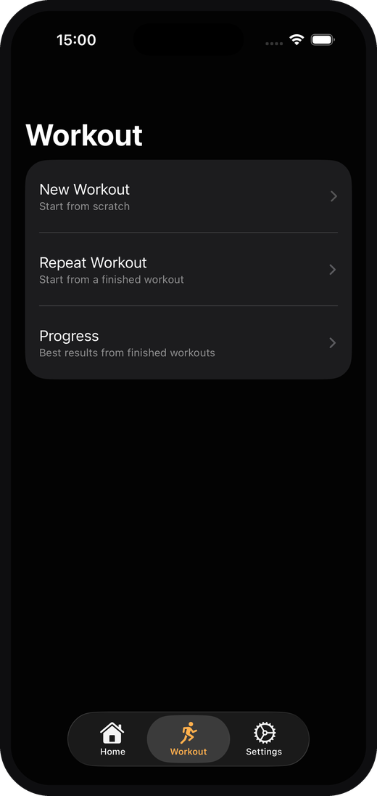
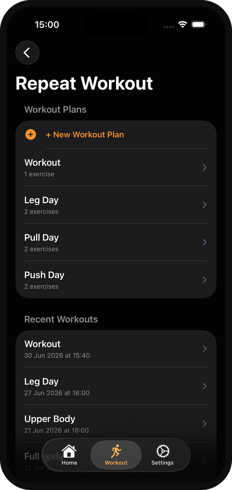
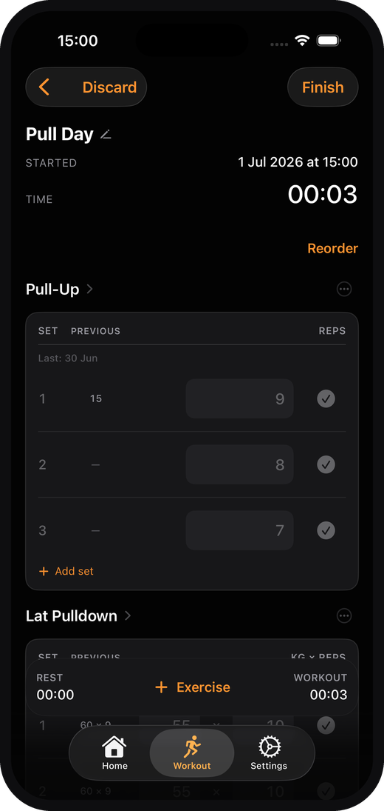
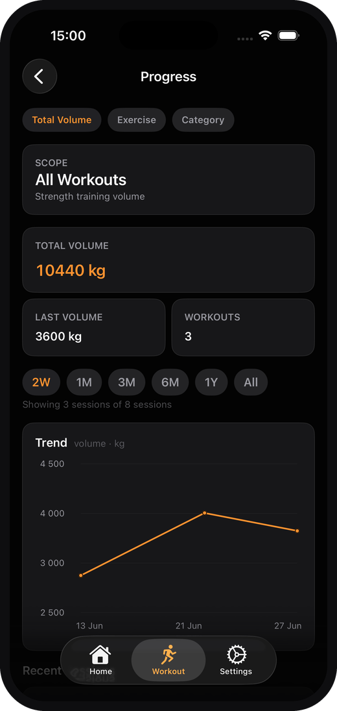
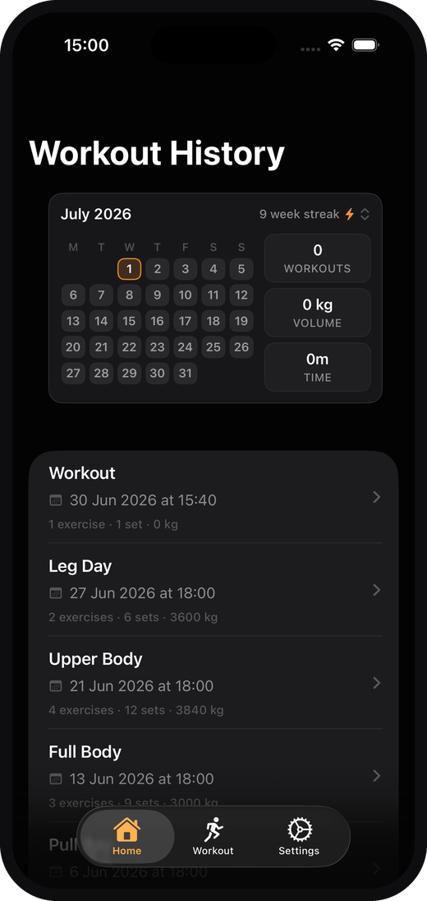

# JIMM

A focused, offline-first iOS workout tracker built with SwiftUI and SwiftData. JIMM makes logging a training session fast and friction-free: pick exercises, log your sets, rest with a Live Activity timer, and review your progress over time - all on-device, no account required.

> Personal portfolio project. Native iOS, built from scratch in Swift.

## Screenshots

<table>
  <tr>
    <td align="center">
      <br />
      <sub><b>Workout</b></sub>
    </td>
    <td align="center">
      <br />
      <sub><b>Repeat Workout</b></sub>
    </td>
    <td align="center">
      <br />
      <sub><b>Active Workout</b></sub>
    </td>
  </tr>
  <tr>
    <td align="center">
      <br />
      <sub><b>Progress</b></sub>
    </td>
    <td align="center">
      <br />
      <sub><b>Home</b></sub>
    </td>
    <td></td>
  </tr>
</table>

## Features

- **Workout logging** - log sets with weight, reps, hold duration, and distance, with per-set confirmation of suggested values.
- **Multiple exercise types** - strength, bodyweight, cardio, duration, and mobility, each logged with the right fields.
- **Exercise library** - a seeded built-in catalog plus user-saved and session-only custom exercises, with fuzzy search and alias matching.
- **Workout plans / templates** - build reusable plans and start a session from a plan in one tap.
- **Repeat past workouts** - recreate a previous session (exercises + sets) to progressively overload.
- **History & progress** - browse completed sessions and track progress over time.
- **Rest timer with Live Activities** - a rest countdown shown on the Lock Screen and Dynamic Island via ActivityKit, with deep-link back into the active session.
- **Onboarding** - a lightweight first-run flow.
- **Appearance settings** - system / light / dark.
- **Share a workout** - export a shareable workout summary sticker.

## Tech stack

- **Language:** Swift 5
- **UI:** SwiftUI
- **Persistence:** SwiftData (on-device model container)
- **Live Activities:** ActivityKit + WidgetKit (Rest Timer extension)
- **State:** `@AppStorage`, `ObservableObject`, scene-phase reconciliation
- **Deep linking:** custom URL scheme (`mch.jim://active-workout`)
- **Minimum iOS:** 18.0
- **Dependencies:** none (no SPM / CocoaPods / Carthage - pure first-party frameworks)

## Offline-first

JIMM is fully **offline-first**. All data - exercises, sessions, sets, and plans - is stored locally with SwiftData. The app does not require an account, network connection, or backend to function, and makes no network calls. Your training data stays on your device.

## Roadmap

Planned next step: optional authentication with cloud backup and workout sync.

The current version remains offline-first and does not require an account.

## Getting started

### Requirements

- macOS with **Xcode 16+**
- **iOS 18.0+** simulator or device
- An Apple Developer account is only needed to run on a physical device (for code signing).

### Run

1. Clone the repository.
2. Open `JIMM.xcodeproj` in Xcode.
3. Select the `JIMM` scheme and an iOS 18+ simulator (or your device).
4. Build & run (`Cmd + R`).

> If running on a physical device, set your own signing team in **Signing & Capabilities** for the `JIMM` and `RestTimerLiveActivityExtension` targets.

## Privacy

JIMM collects no personal data and contains no analytics or third-party SDKs. All workout data is stored locally on the device using SwiftData and is never transmitted off-device. See `JIMM/PrivacyInfo.xcprivacy` for the app's privacy manifest.

## Project structure

```
JIMM/
├── JIMM/                             # App sources (SwiftUI views, SwiftData models, logic)
│   ├── JIMMApp.swift                 # App entry point & ModelContainer setup
│   ├── Models.swift                  # SwiftData models (Exercise, WorkoutSession, ...)
│   ├── ExerciseCatalog.swift         # Built-in exercise seeding
│   ├── *View.swift                   # SwiftUI screens
│   └── PrivacyInfo.xcprivacy         # Privacy manifest
├── RestTimerLiveActivityExtension/   # Live Activity widget extension
├── SharedLiveActivity/               # Shared ActivityKit attributes
└── JIMM.xcodeproj                    # Xcode project
```

## License

No license is currently specified. This is a personal portfolio project; please contact the author before reuse.


## Status

Planned next step: optional authentication with cloud backup and database-backed workout sync.
